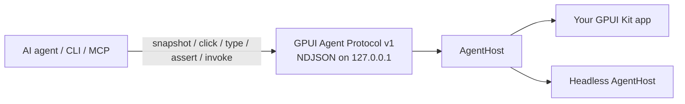

# GPUI Agent Lab

An experimental control plane that lets an AI agent **observe and drive any GPUI Kit 0.6 app without Chrome DevTools Protocol**.

GPUI Kit apps are native GPU surfaces (not Electron, not a DOM). Playwright and CDP have nothing to attach to. This repo is a smaller, in-process alternative: the app publishes a **semantic UI tree** and accepts **scripted actions** over localhost JSON — the same idea as [Vercel Native SDK automation](https://native-sdk.dev/automation), purpose-built for GPUI Kit.

The CLI and MCP tools are **framework-agnostic**. They speak only the protocol ops (`wait`, `hello`, `snapshot`, `click`, `type`, `set-value`, `key`, `assert`, `invoke`, `shutdown`). App-specific verbs belong in the **app** (stable ids + `invoke` names) or in **agent prompts**, not in `gpui-agent`.

**Session reuse.** `AgentClient` keeps one TCP connection across `rpc` calls (the MCP stdio shim already holds one client for the process). `rpc_once` is the old per-op reconnect path, kept for benches. On 32 hellos this is on the order of **600×** vs reconnect; see [docs/PERF.md](docs/PERF.md).

**Recipes (experimental, this stack).** `gpui-agent recipe validate|plan|run` batches many protocol ops in one process on that session. JSON is canonical; `.wants` is a thin alias. See [docs/RECIPES.md](docs/RECIPES.md). Screenshots, TMP cloud, and `rpc_pipeline` are **not** in this phase ([docs/NO_BRAINER_PLAN.md](docs/NO_BRAINER_PLAN.md)).



## Generic CLI

```bash
gpui-agent wait
gpui-agent hello
gpui-agent snapshot --pretty
gpui-agent click nav-settings
gpui-agent click --delivery virtual nav-settings
gpui-agent assert --id page-settings
gpui-agent set-value search-input "query"
gpui-agent type composer "hello"
gpui-agent type --delivery virtual composer "hello"
gpui-agent key composer Enter
gpui-agent invoke prefs.set --arg theme=dark
gpui-agent shutdown
```

Navigation between pages is **click + assert** on stable ids (or `invoke` if the host registered a go-to command). There is no `open-page` CLI verb.

```bash
gpui-agent click nav-settings
gpui-agent assert --id page-settings --role window
```

### Sample todo app (demo only)

`apps/todo` is a demo that assigns ids such as `todo-input` and `todo-add`. Drive it with the **same generic commands**:

```bash
# terminal 1 — set a token *before* starting the host (scripts should)
export GPUI_AGENT=1
export GPUI_AGENT_TOKEN=dev-secret
cargo run -p todo-headless

# terminal 2 — CLI reads GPUI_AGENT_TOKEN from the env
cargo run -p gpui-agent-cli -- wait
cargo run -p gpui-agent-cli -- set-value todo-input "Buy milk"
cargo run -p gpui-agent-cli -- click todo-add
cargo run -p gpui-agent-cli -- assert --id todo-item-1 --name "Buy milk" --checked false
cargo run -p gpui-agent-cli -- click todo-toggle-1
cargo run -p gpui-agent-cli -- assert --id todo-item-1 --checked true
cargo run -p gpui-agent-cli -- click todo-delete-1
cargo run -p gpui-agent-cli -- assert --id todo-item-1 --absent
cargo run -p gpui-agent-cli -- shutdown
```

If you start the host **without** `GPUI_AGENT_TOKEN`, it mints an ephemeral
secret and prints `GPUI_AGENT_TOKEN=…` once on stderr. Copy that into the
CLI env, or pass `--token`. Labs that want the old open loopback socket:
`GPUI_AGENT_ALLOW_EMPTY_TOKEN=1` on the host and `--allow-empty-token` on
the CLI.

The demo host also registers `todo.add` / `todo.toggle` / `todo.delete` / `todo.list` as **`invoke` names** (not CLI subcommands):

```bash
gpui-agent invoke todo.add --arg title="Buy milk"
gpui-agent invoke todo.list
```

Thin wrappers for that demo live in [`examples/todo.sh`](examples/todo.sh). Do not treat them as the public API.

Same loop, one process (experimental recipe; host must be a **fresh** empty list):

```bash
export GPUI_AGENT=1
export GPUI_AGENT_TOKEN=dev-secret
cargo run -p gpui-agent-cli -- recipe run examples/recipes/todo-crud.json --set title="Buy milk"
```

## What this proves

A scripted agent (or `gpui-agent` CLI) can, without a human mouse or keyboard:

1. Read a **structured snapshot** (ids, roles, names, checked state) — not just a screenshot
2. **Act** with `click` / `type` / `set-value` / `key` / `invoke`
3. **Assert** the resulting tree

The desktop app is a real `gpui-kit = "0.6"` window. The same protocol runs against a headless host so CI and display-less VMs can still prove the loop.

## Layout

```
apps/todo             GPUI Kit 0.6 desktop demo
apps/todo-headless    Same domain + protocol, no window
crates/gpui-agent     Protocol, server, client, security, mailbox, ndjson
crates/gpui-agent-cli gpui-agent CLI + tiny MCP stdio shim
crates/gpui-agent-recipe Experimental JSON recipes (validate/plan/run)
crates/todo-core      Demo store and semantic ids
docs/PROTOCOL.md      Wire format
docs/INTEGRATING.md   How to embed AgentHost in another app
docs/NO_BRAINER_PLAN.md  P0–P5 roadmap
docs/PERF.md          P0 Criterion numbers (session vs reconnect)
docs/RECIPES.md       Experimental recipe CLI (stacked P1)
examples/todo.sh      Demo-only invoke wrappers
examples/recipes/     Sample todo CRUD recipe
scripts/smoke.sh      Full CRUD against the headless host
```

## How to run

Requires Rust 1.85+ (CI here uses 1.98). On Linux, GPUI also needs windowing/Vulkan headers (`libxkbcommon-dev`, `libwayland-dev`, `libfontconfig-dev`, `libvulkan-dev`, X11/xcb).

### Headless proof (no display)

```bash
chmod +x scripts/smoke.sh
./scripts/smoke.sh
```

### Desktop app (needs a real display)

```bash
export GPUI_AGENT=1
export GPUI_AGENT_TOKEN=dev-secret
cargo run -p todo
```

Then the same generic CLI commands. Without `GPUI_AGENT=1` the window is a normal app and no socket is opened.

A cloud VM with Xvfb/`DISPLAY` may still fail if Vulkan/GPU is missing. That is a **display/GPU** limit, not a protocol limit. Use `todo-headless` and `cargo test` there.

```bash
cargo test -p gpui-agent -p todo-core -p gpui-agent-cli -p gpui-agent-recipe
```

## Agent loop (perceive → act → verify)

This is the Flutter `ai_flutter_agent` / semantics-tree loop, adapted to GPUI Kit:

1. **Perceive.** `gpui-agent snapshot` (or MCP tool `snapshot`). You get widgets with **stable ids the app assigned**, plus roles, names, and state. Do **not** scrape pixels to decide what to click.
2. **Plan.** Choose an action against those ids. Prefer `invoke` when the host exposes a named command; use `set-value` + `click` (`delivery=semantic`, the default) for CI. Use `--delivery virtual` only when you need the real GPUI pointer/key path (hover, hit-test, focus, IME).
3. **Act.** `click`, `type`, `set-value`, `key`, or `invoke`. Virtual delivery never shares the host HID — it synthesizes events inside the app window and paints an agent cursor overlay.
4. **Verify.** `assert --id page-root` (or re-snapshot and inspect JSON). If the node is missing or the field is wrong, the CLI exits non-zero.

To change screens: click a nav control, then assert the destination root id is present.

## Claude Code / MCP

The CLI includes a tiny MCP stdio server with the **same generic tools** (no app-specific `todo_*` tools):

`wait`, `hello`, `snapshot`, `click`, `type`, `set_value`, `key`, `assert`, `invoke`, `shutdown`

```bash
export GPUI_AGENT=1
export GPUI_AGENT_TOKEN=dev-secret
cargo run -p todo-headless
cargo run -p gpui-agent-cli -- mcp
```

Claude Code (`~/.claude/settings.json` or a project `.mcp.json`):

```json
{
  "mcpServers": {
    "gpui-agent": {
      "command": "gpui-agent",
      "args": ["mcp"],
      "env": {
        "GPUI_AGENT_ADDR": "127.0.0.1:17421",
        "GPUI_AGENT_TOKEN": "dev-secret"
      }
    }
  }
}
```

Start the target app with `GPUI_AGENT=1` and a matching
`GPUI_AGENT_TOKEN` first. Teach the agent your app’s ids and `invoke`
names in a prompt or CLAUDE.md — do not add them as CLI subcommands.

## Why not CDP?

| | CDP / Playwright | Native SDK automation | This protocol |
| --- | --- | --- | --- |
| Target | Chromium DOM / WebView | Native + canvas widgets | GPUI Kit semantic tree |
| How it attaches | Browser debug port | Embedded file-queue server | Embedded localhost NDJSON |
| Snapshot | DOM / a11y | Widget id, role, name, bounds | Same shape: id, role, name, bounds, state |
| Actions | click / type / evaluate JS | widget-click / key / assert | click / type / key / invoke / assert |
| GPU-native GPUI | Cannot attach | N/A | Designed for it |
| CDP compatible | Yes | No | **No — do not claim this** |

Inspiration, not a clone: Native SDK’s “every app embeds a server, publishes a11y, accepts scripted actions.” We use JSON over loopback instead of a command directory because it is easier to test and inspect. File-queue remains a possible later transport.

[themixednuts/gpui-mcp](https://github.com/themixednuts/gpui-mcp) is a different GPUI pin and a broader tooling surface. This lab stays on published `gpui-kit 0.6` and a small versioned protocol.

## Design (what we verified)

The first hypothesis — walk GPUI’s private element tree every frame — is the wrong first slice. GPUI does not expose a stable public walker for that, and tree indices are brittle. AccessKit is the right *future* source of roles/labels, but apps still need **stable test ids**.

What shipped instead (closer to Flutter semantics + Native SDK):

1. **The app owns the semantic tree.** Widgets and the agent call the same methods. Ids are assigned by the app (`submit`, `row-3`), not inferred.
2. **`AgentHost` is the platform seam.** Desktop GPUI, headless, and later web/mobile implement the trait. The wire format does not change.
3. **Desktop bridge is a mailbox.** The TCP thread never touches GPUI objects. The UI thread drains the mailbox so InputState and the store stay in sync. `take` swaps the queue out in one `mem::take`.
4. **Protocol is small and versioned.** See [docs/PROTOCOL.md](docs/PROTOCOL.md). Embedding steps: [docs/INTEGRATING.md](docs/INTEGRATING.md). One TCP session carries many request/response lines.

## Security / trust model

Automation is **opt-in and off by default**. Full audit: [docs/SECURITY.md](docs/SECURITY.md).

| Gate | Default |
| --- | --- |
| Compile | Feature-gate the bridge (this demo’s `todo` feature `agent` is on; a product build should default it **off**) |
| Runtime | `GPUI_AGENT=1` (`true`/`yes`/`on` also work) |
| Release binaries | Also require `GPUI_AGENT_ALLOW_RELEASE=1` |
| Bind address | Loopback only (`127.0.0.1:17421`). Non-loopback `GPUI_AGENT_ADDR` is refused. The CLI also refuses a non-loopback `--addr`. |
| Token | Required by default. Set `GPUI_AGENT_TOKEN` on app and CLI, or copy the ephemeral token the host prints at bind. `--allow-empty-token` / `GPUI_AGENT_ALLOW_EMPTY_TOKEN=1` is a lab opt-out. |
| DoS caps | 1 MiB NDJSON line, 32 concurrent connections, 128 mailbox depth, 30s idle timeout |

Anyone who can connect to that loopback socket **and** present the token
can drive the UI as the user. Treat this as a **developer/agent tool**,
not a remote API. Do not enable it in shipping product builds. There is
no sandbox, no origin check, and no encryption beyond “it never leaves
the machine.”

## Extensibility (desktop now, web/mobile later)

```text
                    gpui-agent protocol v1
                              │
           ┌──────────────────┼──────────────────┐
           ▼                  ▼                  ▼
     AgentHost            AgentHost          AgentHost
     (desktop GPUI)       (headless)         (web / mobile)
           │                  │                  │
     AccessKit + ids      your store         WASM / OS a11y
     mailbox drain        mutex host         same snapshots
```

A later web host (GPUI WASM) or mobile shell should:

- Implement `AgentHost` and keep stable ids
- Optionally fill `bounds` from layout
- Optionally walk AccessKit instead of hand-registering nodes
- Reuse `gpui-agent-cli` unchanged

Do not add CDP compatibility shims; agents should speak this protocol (or MCP tools that wrap it).

## Semantic vs virtual delivery

| | `semantic` (default) | `virtual` |
| --- | --- | --- |
| Path | Handler by stable id | In-process GPUI `dispatch_event` / `dispatch_keystroke` on the UI thread |
| OS mouse / keyboard | Untouched | Untouched (no warp, no PostMessage/XTEST) |
| Window raise | No | Not requested; GPUI may still style an in-window focus ring |
| Agent cursor overlay | No | Painted Div inside the GPUI window (session-colored) |
| Headless | Works | `virtual_unavailable` (honest — no event pipeline, bounds are zero) |
| Use when | CI, agents, fast CRUD | Debugging bugs that only appear on the real input path |

```bash
gpui-agent click --delivery virtual todo-add
```

See [docs/PROTOCOL.md](docs/PROTOCOL.md#delivery-modes-click--type--key).

## Limitations

- **Semantic remains the default.** Virtual is opt-in per op (`delivery: virtual`) and still requires `GPUI_AGENT=1`.
- **Virtual is a first slice:** pointer move/down/up at node bounds + keystrokes into a focused field. No OS cursor warping APIs.
- **Bounds are zero** on the headless host. Desktop fills them from the last painted frame when the agent bridge is on.
- **No screenshot command** yet. Snapshot is structured; add a PNG later via GPUI’s render path if a display exists.
- **The desktop window needs a GPU/display.** Cloud agents should use a headless `AgentHost` + `cargo test`.
- **Not a GPUI patch.** No fork of `gpui-kit`. When GPUI exposes a first-class test-id / a11y export, this crate should consume it instead of a parallel registry.
- **Single-app, local only.** No multi-window routing, no remote attach.

## Next steps

Phased plan (P0 session reuse + P1 experimental recipes): [docs/NO_BRAINER_PLAN.md](docs/NO_BRAINER_PLAN.md).

1. Richer virtual input (scroll, drag, IME composition, multi-click)
2. `screenshot` on desktop when a GPU is present (P3 — honest unavailable on headless)
3. Token required / ephemeral when MCP or recipes are on (P2 — **ask first**)
4. WASM host implementing `AgentHost` for `platform: web`
5. Auto-export nodes from AccessKit so apps register fewer ids by hand
6. GPUI `#[gpui_kit::test]` visual tests once `test-support` is wired through the same store

## License

Apache-2.0. GPUI Kit is Apache-2.0 ([Longbridge / huacnlee](https://github.com/longbridge/gpui-kit)).
