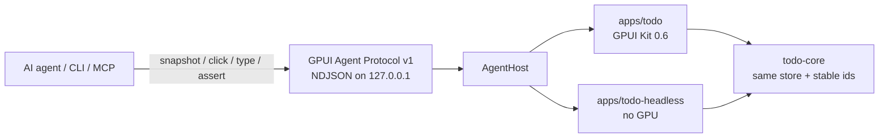

# GPUI Agent Lab
An experimental control plane that lets an AI agent **observe and drive a GPUI Kit 0.6 app without Chrome DevTools Protocol**.

GPUI Kit apps are native GPU surfaces (not Electron, not a DOM). Playwright and CDP have nothing to attach to. This repo proves a smaller, in-process alternative: the app publishes a **semantic UI tree** and accepts **scripted actions** over localhost JSON — the same idea as [Vercel Native SDK automation](https://native-sdk.dev/automation), purpose-built for GPUI Kit.



## What this proves

A scripted agent (or `gpui-agent` CLI) can, without a human mouse or keyboard:

1. Read a **structured snapshot** (ids, roles, names, checked state) — not just a screenshot
2. **Create** a todo
3. **Check / uncheck** it
4. **Delete** it
5. **Assert** the resulting tree

The desktop app is a real `gpui-kit = "0.6"` window. The same protocol runs against a headless host so CI and display-less VMs can still prove the loop.

## Layout

```
apps/todo             GPUI Kit 0.6 desktop todo
apps/todo-headless    Same domain + protocol, no window
crates/gpui-agent     Protocol, server, client, security, mailbox
crates/gpui-agent-cli gpui-agent CLI + tiny MCP stdio shim
crates/todo-core      Shared store and semantic ids
docs/PROTOCOL.md      Wire format
scripts/smoke.sh      Full CRUD against the headless host
```

## How to run

Requires Rust 1.85+ (CI here uses 1.98). On Linux, GPUI also needs windowing/Vulkan headers (`libxkbcommon-dev`, `libwayland-dev`, `libfontconfig-dev`, `libvulkan-dev`, X11/xcb).

### Headless proof (no display)

```bash
chmod +x scripts/smoke.sh
./scripts/smoke.sh
```

Or by hand:

```bash
# terminal 1
GPUI_AGENT=1 cargo run -p todo-headless

# terminal 2
cargo run -p gpui-agent-cli -- wait
cargo run -p gpui-agent-cli -- set-value todo-input "Buy milk"
cargo run -p gpui-agent-cli -- click todo-add
cargo run -p gpui-agent-cli -- assert --id todo-item-1 --name "Buy milk" --checked false
cargo run -p gpui-agent-cli -- click todo-toggle-1
cargo run -p gpui-agent-cli -- assert --id todo-item-1 --checked true
cargo run -p gpui-agent-cli -- click todo-delete-1
cargo run -p gpui-agent-cli -- assert --id todo-item-1 --absent
cargo run -p gpui-agent-cli -- shutdown
```

Helpers for agents that prefer named commands:

```bash
gpui-agent todo add "Buy milk"
gpui-agent todo toggle 1
gpui-agent todo delete 1
gpui-agent todo list
gpui-agent snapshot --pretty
```

### Desktop app (needs a real display)

```bash
GPUI_AGENT=1 cargo run -p todo
```

Then the same CLI commands. Without `GPUI_AGENT=1` the window is a normal todo app and no socket is opened.

A cloud VM with Xvfb/`DISPLAY` may still fail if Vulkan/GPU is missing. That is a **display/GPU** limit, not a protocol limit. Use `todo-headless` and `cargo test` there.

```bash
cargo test -p gpui-agent -p todo-core -p gpui-agent-cli
```

## Agent loop (perceive → act → verify)

This is the Flutter `ai_flutter_agent` / semantics-tree loop, adapted to GPUI Kit:

1. **Perceive.** `gpui-agent snapshot` (or MCP tool `snapshot`). You get widgets with stable ids (`todo-input`, `todo-add`, `todo-item-1`, `todo-toggle-1`, `todo-delete-1`), roles, names, and state. Do **not** scrape pixels to decide what to click.
2. **Plan.** Choose an action against those ids. Prefer `invoke` / `todo add` for high-level work; use `set-value` + `click` when you want to exercise the same path as a human.
3. **Act.** `click`, `type`, `set-value`, `key`, or `invoke`.
4. **Verify.** `assert --id todo-item-1 --checked true` (or re-snapshot and inspect JSON). If the node is missing or the field is wrong, the CLI exits non-zero.

Tiny MCP stdio shim (same tools):

```bash
GPUI_AGENT=1 cargo run -p todo-headless
cargo run -p gpui-agent-cli -- mcp
```

## Why not CDP?

| | CDP / Playwright | Native SDK automation | This protocol |
| --- | --- | --- | --- |
| Target | Chromium DOM / WebView | Native + canvas widgets | GPUI Kit semantic tree |
| How it attaches | Browser debug port | Embedded file-queue server | Embedded localhost NDJSON |
| Snapshot | DOM / a11y | Widget id, role, name, bounds | Same shape: id, role, name, bounds, state |
| Actions | click / type / evaluate JS | widget-click / key / assert | click / type / key / invoke / assert |
| GPU-native GPUI | Cannot attach | N/A | Designed for it |
| CDP compatible | Yes | No | **No — do not claim this** |

Inspiration, not a clone: Native SDK’s “every app embeds a server, publishes a11y, accepts scripted actions.” We use JSON over loopback instead of a command directory because it is easier to test and inspect. File-queue remains a possible later transport.

[themixednuts/gpui-mcp](https://github.com/themixednuts/gpui-mcp) is a different GPUI pin and a broader tooling surface. This lab stays on published `gpui-kit 0.6` and a small versioned protocol.

## Design (what we verified)

The first hypothesis — walk GPUI’s private element tree every frame — is the wrong first slice. GPUI does not expose a stable public walker for that, and tree indices are brittle. AccessKit is the right *future* source of roles/labels, but apps still need **stable test ids**.

What shipped instead (closer to Flutter semantics + Native SDK):

1. **`todo-core` owns the semantic tree.** Widgets and the agent call the same methods (`add`, `toggle`, `delete`). Ids are assigned by the app (`todo-toggle-{id}`), not inferred.
2. **`AgentHost` is the platform seam.** Desktop GPUI, headless, and later web/mobile implement the trait. The wire format does not change.
3. **Desktop bridge is a mailbox.** The TCP thread never touches GPUI objects. `TodoApp::render` drains the mailbox on the UI thread so InputState and the store stay in sync.
4. **Protocol is small and versioned.** See [docs/PROTOCOL.md](docs/PROTOCOL.md).

## Security / trust model

Automation is **opt-in and off by default**.

| Gate | Default |
| --- | --- |
| Compile | `todo` feature `agent` (on for this demo; a product build should default it **off**) |
| Runtime | `GPUI_AGENT=1` (`true`/`yes`/`on` also work) |
| Release binaries | Also require `GPUI_AGENT_ALLOW_RELEASE=1` |
| Bind address | Loopback only (`127.0.0.1:17421`). Non-loopback `GPUI_AGENT_ADDR` is refused |
| Optional token | `GPUI_AGENT_TOKEN` — every request must repeat it |

Anyone who can connect to that loopback socket can drive the UI as the user. Treat this as a **developer/agent tool**, not a remote API. Do not enable it in shipping product builds. There is no sandbox, no origin check, and no encryption beyond “it never leaves the machine.”

## Extensibility (desktop now, web/mobile later)

```text
                    gpui-agent protocol v1
                              │
           ┌──────────────────┼──────────────────┐
           ▼                  ▼                  ▼
     AgentHost            AgentHost          AgentHost
     (desktop GPUI)       (headless)         (web / mobile)
           │                  │                  │
     AccessKit + ids      todo-core          WASM / OS a11y
     mailbox drain        mutex host         same snapshots
```

A later web host (GPUI WASM) or mobile shell should:

- Implement `AgentHost` and keep stable ids
- Optionally fill `bounds` from layout
- Optionally walk AccessKit instead of hand-registering nodes
- Reuse `gpui-agent-cli` unchanged

Do not add CDP compatibility shims; agents should speak this protocol (or MCP tools that wrap it).

## Limitations

- **v1 dispatches semantic actions**, not synthesized OS pointer events. A click on `todo-add` calls the add handler; it does not move a real cursor. That is more reliable for agents and less complete for “did the hit-test match the pixel?”
- **Bounds are zero** on the headless host and not yet read back from GPUI layout.
- **No screenshot command** yet. Snapshot is structured; add a PNG later via GPUI’s render path if a display exists.
- **The desktop window needs a GPU/display.** Cloud agents should use `todo-headless` + `cargo test`.
- **Not a GPUI patch.** No fork of `gpui-kit`. When GPUI exposes a first-class test-id / a11y export, this crate should consume it instead of a parallel registry.
- **Single-app, local only.** No multi-window routing, no remote attach.

## Next steps

1. Fill `bounds` from GPUI layout / AccessKit after each frame
2. Optional synthesized pointer/key events for widgets that have no semantic handler
3. `screenshot` on desktop when a GPU is present
4. WASM host implementing `AgentHost` for `platform: web`
5. Auto-export nodes from AccessKit so apps register fewer ids by hand
6. GPUI `#[gpui_kit::test]` visual tests once `test-support` is wired through the same store

## License

Apache-2.0. GPUI Kit is Apache-2.0 ([Longbridge / huacnlee](https://github.com/longbridge/gpui-kit)).
