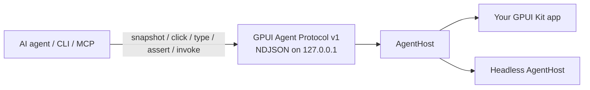

# GPUI Agent Lab

An experimental control plane for GPUI Kit apps that **embed** an `AgentHost`, publish **stable ids**, and start the server under `GPUI_AGENT=1`. This is **not** Chrome DevTools Protocol and does **not** attach to an arbitrary process.

GPUI Kit apps are native GPU surfaces (not Electron, not a DOM). Playwright and CDP have nothing to attach to. This repo is a smaller, in-process alternative: the app publishes a **semantic UI tree** and accepts **scripted actions** over localhost JSON — the same idea as [Vercel Native SDK automation](https://native-sdk.dev/automation), purpose-built for GPUI Kit.

The CLI and MCP tools are **framework-agnostic**. They speak only the protocol ops (`wait`, `hello`, `snapshot`, `screenshot`, `click`, `type`, `set-value`, `key`, `keybinding`, `keybindings`, `assert`, `invoke`, `shutdown`). App-specific verbs belong in the **app** (stable ids + `invoke` names) or in **agent prompts**, not in `gpui-agent`.

**Session reuse.** `AgentClient` keeps one TCP connection across `rpc` calls (the MCP stdio shim already holds one client for the process). `rpc_once` is the old per-op reconnect path, kept for benches. On 32 hellos this is on the order of **600×** vs reconnect; see [docs/PERF.md](docs/PERF.md).

**Experimental recipes (P1).** JSON is canonical (`.wants` also accepted). `gpui-agent recipe validate|plan|run|resolve` (and MCP `recipe_*`) batch many protocol ops in one process on that kept session. **P2:** `recipe run` and `mcp` require a non-empty `GPUI_AGENT_TOKEN` or `--token` (same value on the host). **P3:** `screenshot` writes a PNG of the **app window** on macOS when the in-process host is running (`cargo run -p todo --features embedded-host`, `screencapture -l`, Screen Recording). Headless, the default GUI-as-daemon-client, and Linux/Windows stay `screenshot_unavailable` (no fake file). **P4:** GitHub Actions runs the headless recipe and fails unless the receipt is `"ok": true`. See [docs/RECIPES.md](docs/RECIPES.md#ci-p4), [docs/RECORDING.md](docs/RECORDING.md). Roadmap: [docs/NO_BRAINER_PLAN.md](docs/NO_BRAINER_PLAN.md). Leftover experimental PRs: [docs/STACK_HYGIENE.md](docs/STACK_HYGIENE.md).



## Generic CLI

```bash
gpui-agent wait
gpui-agent hello
gpui-agent snapshot --pretty
gpui-agent screenshot --out artifacts/steps/mid.png
gpui-agent screenshot --out tall.png --mode scrolled --target todo-list-scroll
gpui-agent click nav-settings
gpui-agent click --delivery virtual nav-settings
gpui-agent assert --id page-settings
gpui-agent set-value search-input "query"
gpui-agent type composer "hello"
gpui-agent type --delivery virtual composer "hello"
gpui-agent key composer Enter
gpui-agent keybindings
gpui-agent keybinding --id todo.go_settings --scope global
gpui-agent keybinding --id app.quit --scope global --confirm
gpui-agent invoke prefs.set --arg theme=dark
gpui-agent shutdown
```

Navigation between pages is **click + assert** on stable ids (or `invoke` if the host registered a go-to command). There is no `open-page` CLI verb.

```bash
gpui-agent click nav-settings
gpui-agent assert --id page-settings --role page
```

### Sample todo app (demo only)

`apps/todo` is a demo that assigns ids such as `todo-input` and `todo-add`. Drive it with the **same generic commands**:

```bash
# terminal 1
GPUI_AGENT=1 cargo run -p todo-headless -- serve

# terminal 2
cargo run -p gpui-agent-cli -- wait
cargo run -p gpui-agent-cli -- set-value todo-input "Buy milk"
cargo run -p gpui-agent-cli -- click todo-add
cargo run -p gpui-agent-cli -- assert --id todo-item-1 --name "Buy milk" --checked false
cargo run -p gpui-agent-cli -- click todo-toggle-1
cargo run -p gpui-agent-cli -- assert --id todo-item-1 --checked true
cargo run -p gpui-agent-cli -- click todo-delete-1
cargo run -p gpui-agent-cli -- assert --id todo-item-1 --absent
cargo run -p gpui-agent-cli -- shutdown
```

**Experimental — one invocation, many ops.** Prefer a JSON recipe over
spawning `gpui-agent` per click (each spawn is a process + TCP
handshake). `AgentClient` reuses one loopback session; each step is
still a normal token-bearing request. Semantic delivery stays the
default. **`recipe run` and `mcp` require a non-empty token**
(`GPUI_AGENT_TOKEN` or `--token`). Set the **same** value on the host.
One-off `click` / `snapshot` / `hello` must send that token too.
`GPUI_AGENT_INSECURE_NO_TOKEN=1` is the only untokened loopback (demo).

```bash
# terminal 1
export GPUI_AGENT=1
export GPUI_AGENT_TOKEN=dev-secret
cargo run -p todo-headless -- serve

# terminal 2 — same token
export GPUI_AGENT_TOKEN=dev-secret
cargo run -p gpui-agent-cli -- recipe run examples/recipes/todo-crud.json --set title="Buy milk"
```

`recipe validate` / `recipe plan` / `recipe resolve` need no host.
`recipe resolve "add a todo titled Buy milk"` maps prose through a
local schema (fail closed). Shutdown inside a recipe needs `--yes`.
Design, threat model, schema allow-list: [docs/RECIPES.md](docs/RECIPES.md).
Caps recipes must not bypass: [docs/SECURITY.md](docs/SECURITY.md#recipes-experimental).
Laptop copy-paste: [docs/TRY_ON_MAC.md](docs/TRY_ON_MAC.md). Headless is
enough; desktop `todo` is optional and needs a display.

The demo host also registers `todo.add` / `todo.toggle` / `todo.delete` / `todo.list` as **`invoke` names** (not CLI subcommands):

```bash
gpui-agent invoke todo.add --arg title="Buy milk"
gpui-agent invoke todo.list
```

Thin wrappers for that demo live in [`examples/todo.sh`](examples/todo.sh). Do not treat them as the public API.

## What this proves

A scripted agent (or `gpui-agent` CLI) can, without a human mouse or keyboard:

1. Read a **structured snapshot** (ids, roles, names, checked state) — pixels are optional
2. **Act** with `click` / `type` / `set-value` / `key` / `keybinding` / `invoke`
3. **Assert** the resulting tree (and optionally inspect a step PNG)

The desktop app is a real `gpui-kit = "0.6"` window. The same protocol runs against a headless host so CI and display-less VMs can still prove the loop.

## Layout

```
apps/todo                  GPUI Kit 0.6 desktop **client** of the daemon (ADR-001)
apps/todo-headless         Logic daemon: serve / status / shutdown (no GPU)
crates/gpui-agent          Embeddable SDK: protocol, server, client, tree, TestHost
crates/gpui-agent-cli      gpui-agent CLI + tiny MCP stdio shim
crates/gpui-agent-recipe   Experimental recipes + TMP-inspired mapping
crates/todo-core           Demo store and semantic ids
docs/README.md             Doc index
docs/ADR-001-daemon-sot.md Daemon is source of truth; GUI is a client
docs/SDK.md                Embeddable SDK cookbook
docs/INSTALL.md            cargo install CLI + daemon (no GPUI)
docs/PROTOCOL.md           Wire format
docs/INTEGRATING.md        How to embed AgentHost in another app
docs/NO_BRAINER_PLAN.md    P0–P5 roadmap (P3 Mac PNG merged as #20)
docs/STACK_HYGIENE.md      P5 leftover experiment PRs
docs/RECORDING.md          P3 screenshot backends (Mac window vs honest unavailable)
docs/PERF.md               P0 Criterion numbers (session vs reconnect)
docs/RECIPES.md            Experimental recipes (JSON canonical)
docs/TRY_ON_MAC.md         Pull + run recipes on a laptop (headless first)
docs/SECURITY.md           Trust model, caps, remote bind, recipe threat model
examples/todo.sh           Demo-only invoke wrappers
examples/recipes/          Sample todo CRUD recipe (JSON + wants)
scripts/smoke.sh           Full CRUD against the headless host
scripts/smoke-daemon.sh    Daemon serve / status / shutdown
scripts/ci-recipe.sh       CI recipe receipt assert (ok + session_reused)
.github/workflows/ci.yml   ubuntu-latest: cargo test + ci-recipe.sh + release artifacts
```

## How to run

Requires Rust 1.85+ (CI here uses 1.98). On Linux, GPUI also needs windowing/Vulkan headers (`libxkbcommon-dev`, `libwayland-dev`, `libfontconfig-dev`, `libvulkan-dev`, X11/xcb).

### Headless proof (no display)

```bash
chmod +x scripts/smoke.sh
./scripts/smoke.sh
```

Experimental recipes (one CLI invocation, one TCP session). **Same
token in both terminals** (`recipe run` / `mcp` refuse without one).
Copy-paste: [docs/TRY_ON_MAC.md](docs/TRY_ON_MAC.md).

```bash
# terminal 1
export GPUI_AGENT=1
export GPUI_AGENT_TOKEN=dev-secret
cargo run -p todo-headless -- serve

# terminal 2
export GPUI_AGENT_TOKEN=dev-secret
cargo run -p gpui-agent-cli -- recipe run examples/recipes/todo-crud.json --set title="Buy milk"
```

### Desktop app (needs a real display)

The window is a **client of the daemon** ([ADR-001](docs/ADR-001-daemon-sot.md)). Start `todo-headless serve` first. Widget E2E (in-process `AgentHost`) is `cargo run -p todo --features embedded-host` with `GPUI_AGENT=1`.

```bash
# terminal 1 — source of truth
GPUI_AGENT=1 cargo run -p todo-headless -- serve

# terminal 2 — GUI client
cargo run -p todo
```

A cloud VM with Xvfb/`DISPLAY` may still fail if Vulkan/GPU is missing. That is a **display/GPU** limit, not a protocol limit. Use `todo-headless` and `cargo test` there.

```bash
cargo test -p gpui-agent -p todo-core -p gpui-agent-cli -p gpui-agent-recipe
```

## Agent loop (perceive → act → verify)

This is the Flutter `ai_flutter_agent` / semantics-tree loop, adapted to GPUI Kit:

1. **Perceive.** `gpui-agent snapshot` (or MCP tool `snapshot`). You get widgets with **stable ids the app assigned**, plus roles, names, and state. Do **not** scrape pixels to decide what to click.
2. **Plan.** Choose an action against those ids. Prefer `invoke` when the host exposes a named command; use `set-value` + `click` (`delivery=semantic`, the default) for CI. Use `--delivery virtual` only when you need the real GPUI pointer/key path (hover, hit-test, focus, IME).
3. **Act.** `click`, `type`, `set-value`, `key`, `keybinding`, or `invoke`. Virtual delivery never shares the host HID — it synthesizes events inside the app window and paints an agent cursor overlay. `keybinding` fires GPUI Actions (keymap path); free-form `key` has no modifiers.
4. **Verify.** `assert --id page-root` (or re-snapshot and inspect JSON). Optionally `screenshot --out FILE.png` between steps so an agent can see the app surface. Headless, the daemon, and Linux/Windows return `screenshot_unavailable` instead of a fake image. A real PNG is macOS **embedded-host** only (`screencapture -l` of that window). If the node is missing or the field is wrong, the CLI exits non-zero.

To change screens: click a nav control, then assert the destination root id is present.

## Claude Code / MCP

The CLI includes a tiny MCP stdio server with the **same generic tools** (no app-specific `todo_*` tools):

`wait`, `hello`, `snapshot`, `screenshot`, `click`, `type`, `set_value`, `key`, `keybinding`, `keybindings`, `assert`, `invoke`, `shutdown`

plus experimental `recipe_validate` / `recipe_plan` / `recipe_run` /
`recipe_resolve` (JSON canonical; see [docs/RECIPES.md](docs/RECIPES.md)).

```bash
# terminal 1
export GPUI_AGENT=1
export GPUI_AGENT_TOKEN=dev-secret
cargo run -p todo-headless -- serve

# terminal 2
export GPUI_AGENT_TOKEN=dev-secret
cargo run -p gpui-agent-cli -- mcp
```

Claude Code (`~/.claude/settings.json` or a project `.mcp.json`):

```json
{
  "mcpServers": {
    "gpui-agent": {
      "command": "gpui-agent",
      "args": ["mcp"],
      "env": {
        "GPUI_AGENT_ADDR": "127.0.0.1:17421",
        "GPUI_AGENT_TOKEN": "dev-secret"
      }
    }
  }
}
```

Start the target app with `GPUI_AGENT=1` first. Teach the agent your app’s ids and `invoke` names in a prompt or CLAUDE.md — do not add them as CLI subcommands.

## Why not CDP?

| | CDP / Playwright | Native SDK automation | This protocol |
| --- | --- | --- | --- |
| Target | Chromium DOM / WebView | Native + canvas widgets | GPUI Kit semantic tree |
| How it attaches | Browser debug port | Embedded file-queue server | Embedded localhost NDJSON |
| Snapshot | DOM / a11y | Widget id, role, name, bounds | Same shape: id, role, name, bounds, state |
| Actions | click / type / evaluate JS | widget-click / key / assert | click / type / key / keybinding / invoke / assert |
| GPU-native GPUI | Cannot attach | N/A | Designed for it |
| CDP compatible | Yes | No | **No — do not claim this** |

Inspiration, not a clone: Native SDK’s “every app embeds a server, publishes a11y, accepts scripted actions.” We use JSON over loopback instead of a command directory because it is easier to test and inspect. File-queue remains a possible later transport.

[themixednuts/gpui-mcp](https://github.com/themixednuts/gpui-mcp) is a different GPUI pin and a broader tooling surface. This lab stays on published `gpui-kit 0.6` and a small versioned protocol.

## Design (what we verified)

The first hypothesis — walk GPUI’s private element tree every frame — is the wrong first slice. GPUI does not expose a stable public walker for that, and tree indices are brittle. AccessKit is the right *future* source of roles/labels, but apps still need **stable test ids**.

What shipped instead (closer to Flutter semantics + Native SDK):

1. **The app owns the semantic tree.** Widgets and the agent call the same methods. Ids are assigned by the app (`submit`, `row-3`), not inferred.
2. **`AgentHost` is the platform seam.** Desktop GPUI, headless, and later web/mobile implement the trait. The wire format does not change.
3. **Desktop bridge is a mailbox.** The TCP thread never touches GPUI objects. The UI thread drains the mailbox so InputState and the store stay in sync. `take` swaps the queue out in one `mem::take`.
4. **Protocol is small and versioned.** See [docs/PROTOCOL.md](docs/PROTOCOL.md). Embedding steps: [docs/INTEGRATING.md](docs/INTEGRATING.md). One TCP session carries many request/response lines.

## Security / trust model

Automation is **opt-in and off by default**. Full audit: [docs/SECURITY.md](docs/SECURITY.md).

| Gate | Default |
| --- | --- |
| Compile | Feature-gate the in-process bridge. This demo’s `todo` defaults `embedded-host` **off** (GUI is a daemon client). Product builds should keep the equivalent flag **off**. |
| Runtime | `GPUI_AGENT=1` (`true`/`yes`/`on` also work) |
| Release binaries | Also require `GPUI_AGENT_ALLOW_RELEASE=1` |
| Bind address | Loopback default (`127.0.0.1:17421`). Non-loopback needs `GPUI_AGENT_REMOTE=1` **and** a token. The CLI refuses a non-loopback `--addr` unless `--allow-remote` / `GPUI_AGENT_ALLOW_REMOTE=1` **and** a token. Plaintext TCP+token is lab-only. |
| Host token | **Required** to bind (`GPUI_AGENT_TOKEN`). `GPUI_AGENT_INSECURE_NO_TOKEN=1` restores untokened loopback for local demos (loud banner). |
| Required for `recipe run` / `mcp` | Non-empty `GPUI_AGENT_TOKEN` or `--token` on the **client**. Set the **same** value on the host. `hello.auth` is `"required"` or `"none"`. |
| DoS caps | 1 MiB NDJSON line, 32 concurrent connections, 128 mailbox depth, 30s idle timeout |

Anyone who can connect to that loopback socket can drive the UI as the user. Treat this as a **developer/agent tool**, not a remote API. Do not enable it in shipping product builds. There is no sandbox, no origin check, and no encryption beyond “it never leaves the machine.”

## Extensibility (desktop now, web/mobile later)

```text
                    gpui-agent protocol v2
                              │
           ┌──────────────────┼──────────────────┐
           ▼                  ▼                  ▼
     AgentHost            AgentHost          AgentHost
     (desktop GPUI)       (headless)         (web / mobile)
           │                  │                  │
     AccessKit + ids      your store         WASM / OS a11y
     mailbox drain        mutex host         same snapshots
```

A later web host (GPUI WASM) or mobile shell should:

- Implement `AgentHost` and keep stable ids
- Optionally fill `bounds` from layout
- Optionally walk AccessKit instead of hand-registering nodes
- Reuse `gpui-agent-cli` unchanged

Do not add CDP compatibility shims; agents should speak this protocol (or MCP tools that wrap it).

## Semantic vs virtual delivery

| | `semantic` (default) | `virtual` |
| --- | --- | --- |
| Path | Handler by stable id | In-process GPUI `dispatch_event` / `dispatch_keystroke` on the UI thread |
| OS mouse / keyboard | Untouched | Untouched (no warp, no PostMessage/XTEST) |
| Window raise | No | Not requested; GPUI may still style an in-window focus ring |
| Agent cursor overlay | No | Painted Div inside the GPUI window (session-colored) |
| Headless | Works | `virtual_unavailable` (honest — no event pipeline, bounds are zero) |
| Use when | CI, agents, fast CRUD | Debugging bugs that only appear on the real input path |

```bash
gpui-agent click --delivery virtual todo-add
```

See [docs/PROTOCOL.md](docs/PROTOCOL.md#delivery-modes-click--type--key).

## Limitations

- **Semantic remains the default.** Virtual is opt-in per op (`delivery: virtual`) and still requires `GPUI_AGENT=1`.
- **Virtual is a first slice:** pointer move/down/up at node bounds + keystrokes into a focused field. No OS cursor warping APIs.
- **Bounds are zero** on the headless host. Desktop fills them from the last painted frame when the agent bridge is on.
- **`screenshot` is observe-only.** The host writes a local PNG of the app surface (not the desktop). Headless / daemon / Linux / Windows return `screenshot_unavailable` instead of inventing pixels. macOS **embedded-host** `todo` uses `screencapture -l` of this window (Screen Recording). The default GUI client does not host the agent port, so it cannot serve a window PNG. Recipe `--screenshot-dir` lists those paths on the receipt. See [docs/RECORDING.md](docs/RECORDING.md).
- **The desktop window needs a GPU/display.** Cloud agents should use a headless `AgentHost` + `cargo test`.
- **Not a GPUI patch.** No fork of `gpui-kit`. When GPUI exposes a first-class test-id / a11y export, this crate should consume it instead of a parallel registry.
- **Single-app.** No multi-window routing. Remote bind is an authenticated opt-in (plaintext TCP+token, lab-only until TLS). See [docs/SECURITY.md](docs/SECURITY.md).

## Next steps

Phased plan (P0–P5 including P3 Mac PNG [#20](https://github.com/hexuria/gpui-agent/pull/20), pipeline, and MCP hardenings): [docs/NO_BRAINER_PLAN.md](docs/NO_BRAINER_PLAN.md), [docs/STACK_HYGIENE.md](docs/STACK_HYGIENE.md).

1. Richer virtual input (scroll, drag, IME composition, multi-click)
2. WASM host implementing `AgentHost` for `platform: web`
3. Auto-export nodes from AccessKit so apps register fewer ids by hand
4. GPUI `#[gpui_kit::test]` visual tests once `test-support` is wired through the same store
5. `--record` / in-app `render_to_image` in production (ask first; still `test-support` only on this gpui pin)

## License

Apache-2.0. GPUI Kit is Apache-2.0 ([Longbridge / huacnlee](https://github.com/longbridge/gpui-kit)).
